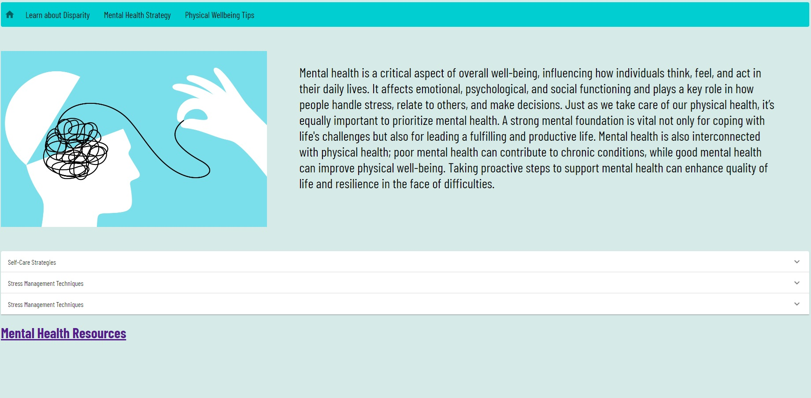

# Care Without Barriers

# Overview

This website aims to raise awareness about healthcare disparities, particularly in mental and physical health, and provide actionable strategies to address these issues. The site serves as an educational resource for individuals and communities, offering information on the factors contributing to health inequities and empowering users to take meaningful steps toward improving their well-being.

# Homepage

# Learn More Page

# Mental Health Page

# Physical Health Page

# To run the website locally, follow these steps:

1. Clone Repo
2. cd into 'mental' folder
3. type npm install in console
4. type npm run dev in console
